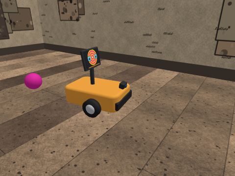
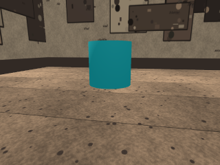
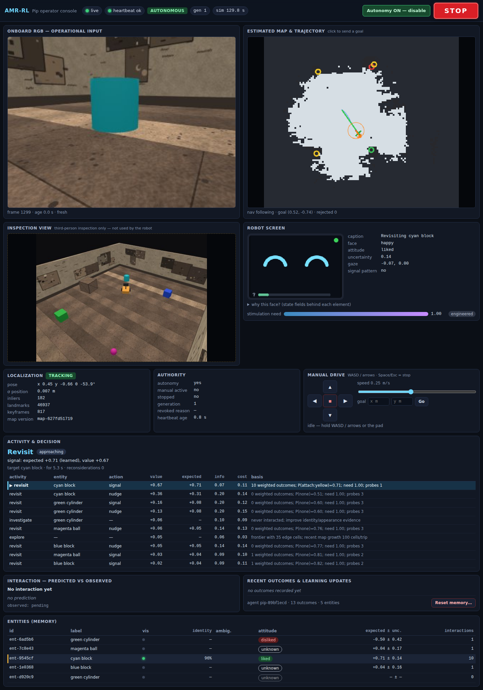
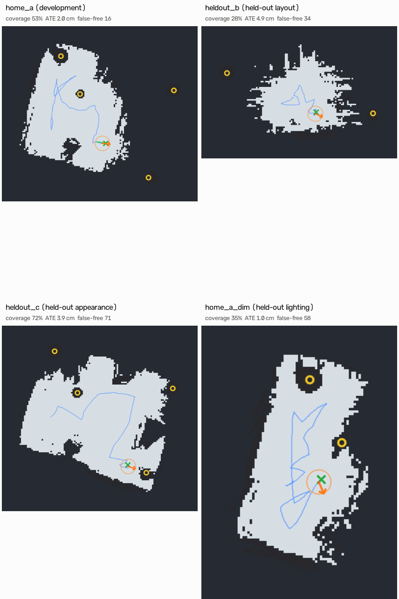

# AMR-RL

**A wheeled indoor robot whose later choices depend on what it has seen happen.**

AMR-RL simulates "Pip", a compact differential-drive robot with one forward RGB
camera and an expressive screen. Using only its own camera, Pip maps a room,
navigates conservatively, and interacts with objects. It records what each
action actually did, as seen in its own images, and uses that remembered
experience to decide what to do next — including after a restart.

Everything here runs in simulation (Genesis World 1.3.2, CPU backend,
lockstep). Nothing has run on hardware.

<p align="center">
  
  
</p>
<p align="center"><em>Left: Pip (inspection camera, never used by the robot), showing its "signal" pattern on the screen.
Right: the same moment from Pip's onboard camera — the only sensor it perceives with.</em></p>

> **What this is not.** It is not a claim of consciousness, emotion or
> self-created desire. What counts as a good or bad consequence is
> **engineered** (a fixed valence table and a "stimulation need"). What the
> robot **learns** is which of its actions, on which objects, in which visible
> state, produce which consequences — and that changes what it chooses later.

---

## Contents

1. [Results summary](#results-summary)
2. [How it works](#how-it-works)
3. [Navigation results](#navigation-results)
4. [Learning results](#learning-results)
5. [Limitations and next gates](#limitations-and-next-gates)
6. [Quick start](#quick-start)
7. [Reproducing the evaluations](#reproducing-the-evaluations)
8. [Repository layout](#repository-layout)
9. [Honesty notes](#honesty-notes)

---

## Results summary

These are round-2 results: navigation in 4 rooms × 3 seeds, and learning on
up to 3 seeds (start poses). That is enough to see failure modes, not to
report statistics. Navigation and learning were evaluated separately. Full
tables with every denominator are in
[docs/NAVIGATION_RESULTS.md](docs/NAVIGATION_RESULTS.md) and
[docs/LEARNING_RESULTS.md](docs/LEARNING_RESULTS.md).

| Question | Result |
|---|---|
| Does remembered experience change later choices? | **Yes, 5/5.** After a restart, every robot that had learned a liked option chose it first (bloom/signal after history_a, stone/signal after history_b, seeds 0–2). With no memory, all three seeds chose roller/signal and then grump/signal. **Carried out on the intended fixture in 3/5:** twice the remembered fixture was not confirmed in fresh images, and the robot moved on. |
| Does it survive a restart without keeping motion permission? | **Yes.** In all 9 restart phases, autonomy started disabled and was enabled only after relocalising from fresh images. |
| Does it avoid what hurt it? | **Yes, 14/14 learned runs.** It saw the red panel once per run and never went back to that fixture or to a duplicate of it. (In round 1 a duplicate identity was re-targeted; duplicates are now merged.) |
| Does it adapt when the rules change? | **Yes, 4/4 informative runs.** Three failed tries of the old option, then it found the new one 100–300 s after the swap. The 2 seed-0 runs are uninformative because seed 0 never learned the old option. |
| Is it better than simple baselines? | **Not shown.** Baselines ran on seed 0 only, and seed 0 is the learned policy's failure case: it never completed an interaction with the rewarding fixture. Total valence: nearest 2.0, random 0.2, learned 0.2, fixed 0.0. On seeds 1–2 the learned policy got 0.57 and 0.54 per outcome, but with no baselines to compare. A control on the round-1 map with the same code learned normally on seed 0, so the failure depends on the map. |
| Can it reach goals in its own map? | **20/37 (54 %)** in the latest run with the depth guard; 22/32 (69 %) in round 2; 5/16 in round 1. Most misses are localisation drift (the robot thinks it arrived but is 16–76 cm off); 3 of 17 may come from the guard's false obstacle marks. In 2 of 12 runs the robot was not localised when goals began. |
| Does it refuse goals it cannot justify? | **Yes, 36/36.** Unknown space is never treated as free. |
| Does it touch things? | **No contacts in the latest 12 navigation runs**, including all 5 box-on-route tests that ran (round 2: 4 of 5 ended in contact). A monocular depth model now stops the robot for objects its map doesn't know about ([details](docs/results/near-field-guard.md)). In learning runs: 0 unintended contacts (round 1: 7; learning not yet re-run with the guard). |


---

## How it works

```
Genesis World (physics + rendering) ── sim/world.py: rooms, fixtures + hidden response rules
      │ onboard RGB (camera_link, 320×240, 10 Hz)      ▲ wheel velocity targets
      ▼                                                │
perception/vslam.py ──pose──► mapping/occupancy.py ──► navigation/planner + navigator
perception/entities.py ──► learning/identity.py ──► learning/memory.py (SQLite + image receipts)
perception/semantic.py (async; labels only, stale/revoked results rejected)
behavior/chooser.py + activities.py ──► control/supervisor.py ──► control/genesis_backend.py
expression/policy.py + screen.py ──► robot screen        ui/server.py + static/ ──► operator console
sim/evaluator.py (ground truth) ── scoring only; never imported by runtime code (tested)
```

### The robot

A generated URDF and GLB meshes, built from an editable spec
([`assets/robot/amr_spec.yaml`](assets/robot/amr_spec.yaml)):

| Item | Value |
|---|---|
| Footprint | 0.35 m × 0.30 m, 0.339 m tall; planning radius 0.262 m (+0.03 m margin) |
| Drive | two driven wheels (r = 0.05 m, track 0.27 m) + passive ball caster; 5.08 kg |
| Actuation | wheel-joint velocity control only; body pose setters used only for explicit resets |
| Camera | pinhole 320×240, 60° vertical FOV, 0.155 m above the floor, pitched 12° down |
| Screen | rendered face on a mast behind the camera; the `signal` action is a real screen pattern that fixtures respond to |

Details: [docs/ROBOT.md](docs/ROBOT.md).

### Perception and mapping (camera only)

* **Monocular visual SLAM on a planar pose:** ORB features, several motion
  hypotheses, guided matching, robust Gauss–Newton pose estimation, keyframes,
  triangulated and floor landmarks, windowed bundle adjustment, relocalization
  against a saved map. **Metric scale** comes from the calibrated camera height
  over a flat floor. Nothing uses simulator poses, depth or labels.
* **Occupancy:** free and obstacle evidence from plane-induced parallax between
  keyframes, with a *detectability gate*: a pixel only gives evidence if a 3 cm
  obstacle there would move by ≥ 3.5 px. Textureless, far or never-seen space
  stays **unknown**, and unknown is never free.
* **Fixtures:** saturated-colour regions; a smaller region resting on a larger
  one is an *attachment* (e.g. a raised panel), which is the visible state.

Details: [docs/VSLAM.md](docs/VSLAM.md).

### Navigation and safety

* A cell is traversable only if every cell within the robot's footprint radius
  is certified free. A* with clearance costs; every rejected goal carries a
  reason (`goal_in_unknown_space`, `goal_occupied`,
  `goal_lacks_footprint_clearance`, …).
* Every control step, the next 0.6 m of path must still be certified, or the
  robot stops at once and replans (at most every 1.5 s). It turns in place only
  if no obstacle evidence lies inside its turning circle; otherwise it backs
  out along its path.
* A **supervisor** owns authority: Stop always wins, commands carry
  generations and expire in 0.2 s, and a missing operator heartbeat, stale
  camera frames or lost localization revoke motion. Lost tracking gets a
  bounded recovery (rotate ≤ 2π or reverse ≤ 0.45 m); **autonomy never resumes
  on its own**.

### Interaction and learning

Four engineered fixtures with hidden rules (in [`configs/consequences/`](configs/consequences)):

| Fixture | Looks like | Standard rule |
|---|---|---|
| bloom | cyan cylinder | `signal` → a yellow panel rises for 8 s |
| grump | green box | `signal` or `nudge` → a red panel rises for 8 s |
| stone | blue box | nothing |
| roller | magenta ball | rolls when nudged (physics, no rule) |

Each interaction runs approach → confirm the target in ≥ 3 fresh frames
(recording the visible context and the **prediction**) → act (`signal`: show a
pattern for 2.2 s from 0.75 m; `nudge`: creep into contact) → observe for 2.5 s →
classify the **observed outcome from pixels** (`moved`, `attach:<colour>`,
`none`, or ambiguous → nothing learned). The receipt (frame hashes, identity
evidence, decision basis, prediction, context, outcome, map/calibration
versions, authority generation) is written with its images **before** the
memory update. Replays are no-ops.

The memory keeps a windowed, time-decayed Dirichlet posterior over outcomes for
each (entity, action, visible context), with change detection. The chooser
scores options as

```
value = need × E[valence] × novelty + curiosity × uncertainty × (0.3 + 0.7·need) − costs
```

and picks among **explore, investigate, engage, revisit, avoid and idle**, with
bounded reconsideration: at most every 3 s, at most 6 switches a minute, and
never in the middle of an interaction. Details: [docs/LEARNING.md](docs/LEARNING.md).

### Operator console

A loopback-only web console showing the onboard camera, the estimated map and
trajectory, localization confidence, the current activity and why it was
chosen (with competing options), entities and learned attitudes, predicted vs
observed outcomes, manual drive, memory reset and **Stop**. Below: a restarted
robot with a trained memory revisiting the fixture it learned to like
(expected +0.71) while listing the green fixture as disliked.



---

## Navigation results

**Protocol:** one fresh process per room and seed; seed *k* turns the start
heading by *k* × 72°. The robot explores for 300 s of simulated time using
only its camera. Then an evaluator acts as the operator: fixed goals (some
deliberately impossible), four goals sampled from the *interior* of the robot's
own certified map, a camera blackout during a goal, and a 35 cm box placed on
the robot's own planned route. When the robot is lost and its bounded recovery
has given up, the evaluator turns it slowly by hand (counted). Arrival means
≤ 0.15 m from the true goal **and** the navigator reporting arrival. `home_a`
was used for development; the other three rooms were never used for tuning.



*Seed 0 maps. Light = certified free, dark = unknown or occupied, blue =
estimated trajectory, rings = detected fixtures.*

Latest run (round 3, with the near-field depth guard), 3 seeds per room:

| Room | Split | Own-map goals arrived | Impossible goals rejected | ATE cm (3 seeds) | Worst error cm | Free coverage | Contact episodes |
|---|---|---|---|---|---|---|---|
| home_a | development | 7/8 | 9/9 | 1.9–2.8 | 5.9 | 46–53 % | 0 |
| heldout_b | held-out layout | 4/9 | 9/9 | 4.9–14.6 | 44.6 | 27–28 % | 0 |
| heldout_c | held-out appearance | 1/8 | 9/9 | 1.3–8.3 | 14.6 | 61–72 % | 0 |
| home_a_dim | held-out lighting | 8/12 | 9/9 | 1.0–4.7 | 7.3 | 35–40 % | 0 |

*ATE: absolute trajectory error (RMS) against ground truth. Round 2 (no guard)
reached 22/32 own-map goals and had 8 contact episodes; see
[docs/NAVIGATION_RESULTS.md](docs/NAVIGATION_RESULTS.md).*

**Reading these results:**

* **Objects placed on the route.** In round 2, 4 of the 5 box-on-route tests
  ended in contact: the map needs several snapshots taken while moving to
  overturn "this floor is clear", and a turn on the spot gives none. A monocular
  depth model (Depth Anything V2 Small, Apache-2.0, ~0.2 s per frame on 2 CPU
  cores) now checks the path ahead every 0.3 s, scaled to metres
  by the visible floor. With it: **0 of 5 box tests ended in contact** (4
  stopped and reported blocked, 1 went around and arrived), and no contact
  anywhere in 12 runs ([details](docs/results/near-field-guard.md)).
* **Arrival: 20/37, against 22/32 in round 2.** Most misses are localisation
  drift (10 goals where the robot believed it had arrived but was 16–76 cm off)
  or one VSLAM failure (4 goals). 3 misses may come from the guard: about 23 %
  of the cells it marks as obstacles are on open floor, which can cut certified
  routes. That is the guard's main cost and the next thing to reduce.
* **Earlier VSLAM work still holds:** frozen-estimate detection, landmark
  purging on loss and dead-reckoning-gated relocalisation cut mean error on a
  7-scenario benchmark from 9.7 to 4.9 cm
  ([docs/results/vslam-benchmark.md](docs/results/vslam-benchmark.md)).
* **Blackout handling works:** in all 5 tests that ran, tracking loss revoked
  motion, bounded recovery relocalised the robot, and it was re-enabled
  explicitly; 4 of 5 reached the goal. Skipped tests (no reachable start/end
  pair) stay in the denominator.

---

## Learning results

**Protocol:** every experiment starts from a fresh memory in the arena, with
the four fixtures and a map the robot built itself with the current code. Seed
*k* starts at a different pose and has to relocalise first. Every phase is a
new process: autonomy starts disabled and is enabled only after relocalisation.
Tests after a restart use *inert* rules, so what is measured is the choice
made from memory, not a fresh reward.

### Opposite histories and restart persistence

| Experiment | Seed | Learned in training | First decision after restart | First interactions completed |
|---|---|---|---|---|
| history_a (bloom rewards signal) | 0 | nothing liked | bloom/signal (no evidence) | bloom/signal ×2 |
| | 1 | bloom/signal, P(yellow) = 0.95 | **bloom/signal** | bloom/signal |
| | 2 | bloom/signal, P(yellow) = 0.95 | **bloom/signal** | bloom/signal ×2 |
| history_b (stone rewards signal) | 0 | stone/signal, P(yellow) = 0.84 | **stone/signal** | bloom/signal ×2 (stone not confirmed) |
| | 1 | stone/signal, P(yellow) = 0.95 | **stone/signal** | bloom/signal ×2 (stone not confirmed) |
| | 2 | stone/signal, P(yellow) = 0.93 | **stone/signal** | stone/signal ×2 |
| no_memory | 0–2 | — | roller/signal | roller/signal, grump/signal |

Before acting, the robot must confirm a remembered fixture in fresh images. In
history_b seeds 0 and 1 it did not see the stone from where it stood, so it
aborted and took the next option.

### Changing consequences

| Experiment | Seed | Swap at | Old option tried after swap | New option first rewarded |
|---|---|---|---|---|
| reversal_early | 1 | 108 s | 3× | +302 s (10 yellows) |
| reversal_early | 2 | 153 s | 3× | +249 s (10 yellows) |
| reversal_late | 1 | 360 s | 3× | +132 s (6 yellows) |
| reversal_late | 2 | 360 s | 3× | +102 s (9 yellows) |

Change detection is adaptive: the number of failures needed is the smallest
run that would be unlikely (p < 0.05) under the learned success rate, between
3 and 8.

### Seed 0, baselines and the control

On seed 0 the learned robot never completed an interaction with bloom (4
approaches lost tracking beside the tall cylinder, 1 failed to plan). The
baselines, the inert world and the noisy world ran on seed 0 only, so they
compare little:

| Policy (seed 0) | Outcomes | Useful | Aversive | Total valence |
|---|---|---|---|---|
| Learned | 10 | 2 | 1 | 0.2 |
| Nearest first | 23 | 5 | 1 | 2.0 |
| Random | 7 | 2 | 1 | 0.2 |
| Fixed order | 53 | 0 | 0 | 0.0 |

The fixed baseline nudged grump 53 times and never touched it: the robot's
estimate of the box's position was 12 cm too near, so the nudge stopped about
10 cm short. That is a limitation of the nudge, not evidence about the rules.
It is now fixed: the creep uses the measured range to the object's nearest floor
contact, and in a static probe boxes seen corner-on are reached in 27/27 views
instead of 21/27 ([docs/results/nudge-reach.md](docs/results/nudge-reach.md)).
The learning evaluation has not been re-run with the fix.

A **control** ran history_a and history_b on seed 0 with the same code and the
round-1 map. There, history_a learned bloom (4 yellows, total valence 3.0) and
both restarts chose the learned option. Since the simulator is deterministic,
the seed-0 failure comes from the map input, even though the new map scores
better (ATE 1.4 vs 4.1 cm, coverage 60 vs 49 %).

The inert world settled (10 outcomes in the first half, 5 in the second). The
noisy world is untested this round: on seed 0 the robot never signalled the
noisy fixture.

---

## Limitations and next gates

The full status of every capability is in
[docs/CAPABILITY_LEDGER.md](docs/CAPABILITY_LEDGER.md).

**Known limitations**

* **Newly placed obstacles:** handled by the depth guard in simulation (0/5
  box tests in contact), but about 23 % of the cells it marks are on open floor,
  and the model has only seen simulated images.
* **Localisation drift in held-out rooms** is now the main reason goals are missed.
* **Relocalisation:** wrong fixes of 10–20 cm, heading errors during in-place
  rotation, and no way to relocalise while stationary once recovery is used up.
* **Tracking near tall objects:** approaching or nudging the cylinder can blind
  the camera; this caused the seed-0 learning failure.
* **Map quality:** 29–73 % coverage in 300 s; the floor test still lets a few
  hits inside obstacles become free (up to 103 deep false-free cells in one run).
* **Nudge reach (fixed, not re-evaluated):** the creep used to be planned from the
  estimated centre, which is 10+ cm off for boxes seen at an angle.
* **Evidence strength:** 3 seeds at most, one arena, fixed fixture positions;
  baselines and the inert and noisy worlds on one seed.
* **Perception generality:** the detector relies on uniformly painted objects
  in desaturated rooms.

**Next gates**

1. **Navigation reliability:** reduce the depth guard's false obstacle marks
   (write only cells near the planned path), cut localisation drift in held-out
   rooms, reject wrong relocalisations, and relocalise while stationary.
2. **Statistical learning evaluation:** 10 or more seeds with randomised start
   poses and fixture placements, baselines on every seed, and reporting of
   distributions.
3. **Interaction:** re-run learning with the nudge fix; keeping
   tracking beside tall objects.
4. **Perception:** a learned detector behind the same contract (pixels in,
   labelled regions out; never coordinates or motor commands). A survey of
   VLMs/VLAs for this robot ([docs/research/VLM_VLA_SURVEY.md](docs/research/VLM_VLA_SURVEY.md))
   found no single model that can run the whole stack. Small open VLMs
   (Qwen3-VL-2B, Moondream 2) are the best fit for detection and outcome
   judging. A monocular depth model is a candidate near-field cue for newly placed
   obstacles.
5. **Hardware:** a drive adapter behind the same supervisor, a physical
   emergency stop, real camera calibration, and perception running off the
   control thread in real time.

---

## Quick start

Requires Python 3.12. Linux x86_64 with the CPU backend and headless EGL was
used for all evidence; on macOS, Genesis uses its Metal/CPU backends.

```bash
git clone https://github.com/Nitish05/AMR-RL.git && cd AMR-RL
scripts/amr.sh setup                    # isolated .venv: genesis-world 1.3.2, torch, transformers, opencv, ...
scripts/amr.sh fetch-depth-model        # optional: depth model for the near-field guard (~100 MB, Apache-2.0,
                                        # into the Hugging Face cache, not the repo); without it the guard is off
scripts/amr.sh test                     # 256 tests + ruff + UI script checks (fast, no simulation)
RUN_GENESIS=1 scripts/amr.sh test-sim   # real Genesis checks: body, wheels, camera, screen, fixtures

# Operator console (loopback only). Autonomy starts DISABLED; press "Enable autonomy".
scripts/amr.sh app --world arena
open http://127.0.0.1:8770/
```

Use `AMR_PYTHON=/path/to/python scripts/amr.sh …` to select another
interpreter. The app takes `--map <saved map dir>`, `--memory <sqlite path>`
and `--consequences <standard|swapped|inert|noisy>`.

## Reproducing the evaluations

Each command writes a fresh evidence directory under `work/evidence/` (git
ignores it) with provenance: git commit, config and asset hashes, and
environment.

```bash
scripts/amr.sh map --world arena --seconds 420                       # build + save an arena map by exploration
scripts/amr.sh eval-nav --worlds home_a heldout_b heldout_c home_a_dim --map-seconds 300 --seeds 0 1 2
scripts/amr.sh eval-learning --map work/evidence/<map-arena-…>/map --seeds 0 1 2   # learning experiments
python scripts/eval/report.py --nav work/evidence/<navigation-…> \
    --learning work/evidence/<learning-…> --out report.md             # tables with denominators
PYTHONPATH=src python scripts/dev/results_figures.py --learning … --nav … --out docs/media
```

The results above come from `navigation-20260930-154854`,
`learning-20260930-154854` and the arena map `map-arena-20260930-122444`; the
control is `learning-control-oldmap` (round-1 map `map-arena-20260929-225035`).
Round-1 results are in the git history. Runs that exposed bugs were kept with a
`SUPERSEDED.md` note naming the bug and its fix. The evidence itself (maps,
receipts, logs, trained memories) is not committed. The simulation runs at
about 0.6–0.8× real time on 2 CPU cores, so the full learning suite takes
several hours.

## Repository layout

| Path | Contents |
|---|---|
| `src/amr_rl/robot/` | spec → URDF/GLB generator |
| `src/amr_rl/sim/` | Genesis world, fixtures and rules, evaluator (ground truth, scoring only), Studio export |
| `src/amr_rl/control/` | command contract, supervisor, Genesis wheel backend |
| `src/amr_rl/perception/` | camera model, visual SLAM, fixture detector, async semantic worker |
| `src/amr_rl/mapping/`, `navigation/` | occupancy evidence, planner, navigator |
| `src/amr_rl/learning/` | identity tracking, outcome classification, SQLite experience memory |
| `src/amr_rl/behavior/` | activities, frontier exploration, chooser |
| `src/amr_rl/expression/`, `ui/` | screen face, operator console |
| `src/amr_rl/evidence/`, `runtime/`, `app.py` | receipts and provenance, runtime loop, operator app |
| `assets/robot/` | editable spec and generated robot assets |
| `configs/worlds/`, `configs/consequences/` | development and held-out rooms; engineered fixture rules |
| `projects/` | Genesis Studio project exports (schema 4) |
| `scripts/` | task runner, evaluation scripts, dev probes |
| `tests/` | unit, privilege-boundary, UI and opt-in Genesis tests |
| `docs/` | design notes, results, capability ledger, provenance |

## Honesty notes

* **Simulation vs hardware:** nothing has run on hardware, and there is no
  hardware adapter. Importing modules or running the simulation never connects
  to hardware.
* **Lockstep vs real time:** physics pauses while perception and decisions
  run. The measured rate (about 0.6–0.8× real time) is not a real-time result.
* **Engineered vs learned:** valences, need dynamics, costs, thresholds and
  fixture rules are engineered. Outcome expectations, attitudes and the
  resulting choices are learned from the robot's own image-grounded outcomes.
* **Development vs held-out:** `home_a`, `arena` and `dev_interact` were used
  for tuning; `heldout_b`, `heldout_c` and `home_a_dim` were not.
* **Provenance:** parts of the evidence, recording and supervisor patterns
  were adapted from an earlier project (BB8-RL). The source commit, file
  hashes and changes are recorded in [docs/PROVENANCE.md](docs/PROVENANCE.md).
  There are no runtime imports from it.
