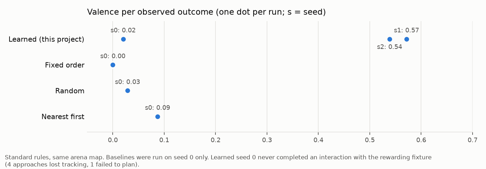

# Learning results (simulation, lockstep)

Evaluated separately from navigation ([NAVIGATION_RESULTS.md](NAVIGATION_RESULTS.md)).

**Protocol** (`scripts/eval/learning.py`): every experiment starts from a FRESH
agent memory in the arena (four engineered fixtures, rules hidden from the
robot, [LEARNING.md](LEARNING.md)) and the same saved map, which the robot built
itself from onboard RGB with the current code (`map-arena-20260930-122444`:
420 s, ATE 1.4 cm, free coverage 60 %, 3 deep false-free cells). Seed *k*
starts at a different pose (`ARENA_STARTS`), so the robot must relocalise
against the saved map before any authority is granted. Every phase is a new
process: autonomy starts disabled and is enabled only after relocalisation.
Test phases after a restart use **inert** consequences, so what is measured is
the choice made from memory, not a fresh reward. The simulator is
deterministic: identical configurations give identical runs.

Round 2 ran **3 seeds** for history_a, history_b, no_memory and both reversal
experiments, and **seed 0 only** for the baselines, the inert and the noisy
world (30 phases, 0 crashes).

Evidence: `work/evidence/learning-20260930-154854`; control run
`work/evidence/learning-control-oldmap`. Regenerate:
`python scripts/eval/report.py --learning work/evidence/learning-20260930-154854 --out <file>`.

## Round 4 (2026-10-03): pre-registered policy comparison

[results/policy-comparison.md](results/policy-comparison.md). These are 75 phases on
`map-arena-20261003-nopano-s2`, with the round-4 relocalisation (every valid start
relocalised correctly, 0 false) and the avoid give-up. In 12 valid cells the
drive-clamped learned policy beat random, nearest-first and fixed-order baselines
on true panel valence: 12/12, 11/12 and 11/12 wins. The deployed policy did too:
12/12, 11/12 and 11/12. The pre-registered decision rule is met. The rest of the
learning suite (restart, reversal, inert, noisy) has not been re-run on round-4 code.

## Summary (round 3, 2026-10-02)

> **Correction (found in round 4):** seed 4's start relocalisation was wrong. It
> started 0.82 m / 22° off, so every seed-4 phase below ran in a wrong frame, and
> its results are invalid. That explains its "None" fixture identity. Across the
> round-3 runs, 65 of 143 relocalisations were false; seeds 0 and 1 started
> correctly. Scored retroactively with `scripts/eval/common.reloc_transitions`.
> The relocalisation was replaced in round 4
> ([results/relocalisation.md](results/relocalisation.md)).

First run on macOS arm64 (local; rounds 1–2 ran on Linux x86-64), with the
nudge-reach fix, the depth guard, the noise-aware `moved` rule and two fixes
found by this run. All 5 arena start poses, every experiment on every seed
(round 2 ran baselines/inert/noisy on seed 0 only). 65 phases, 0 crashes.
Evidence: `work/evidence/learning-20261002-mac2-s{0..4}`, report
`work/evidence/learning-20261002-mac2-report.md`, map
`map-arena-20261002-mac-s1` (best of three seeds, see its `NOTE.md`: ATE 3.6 cm,
coverage 52 %, 5 deep false-free cells, 4 operator re-enables while mapping).

* **Seeds 2 and 3 never relocalised** (start poses (−0.45, −0.45, π) and
  (0.45, 0.3, −π/2)): every phase failed `not_relocalized` despite a 30 s operator
  turn. Results below are seeds **0, 1, 4**. Seeds 3–4 were added after seed 2
  failed. Relocalisation from viewpoints the map did not cover is a navigation
  limit, now measured: 2 of 5 start poses.
* **Restart persistence: 6/6** first decisions after restart targeted the learned
  option (history_a → bloom/signal, history_b → stone/signal, seeds 0, 1, 4).
  **Carried out on that fixture in 3/6.** Seed 0 history_b first completed roller,
  seed 4 history_a first completed grump, and seed 4 history_b completed nothing (its
  learned identity was not matched to any fixture within 0.5 m by the evaluator).
  Why the first two diverged was not analysed.
* **Reversal: 6/6 adapted** (early and late swap, seeds 0, 1, 4); the new option
  was found 85–328 s after the swap.
* **Aversion held:** at most one red panel per learned run. The nearest-first
  baseline on seed 0 took 31 red panels (total valence −29.8).
* **Policy vs baselines: still not shown on total valence.** Seeds 1 and 4 start
  next to bloom; fixed and nearest signal it non-stop (76 and 57 outcomes, total
  valence 38.0 and 29.0) while the learned policy idles once its engineered
  stimulation need is met (idle 0.21 / 0.48; total valence 6.0 / 9.0). Valence per
  outcome: learned 0.32 / 0.46 / 0.69 (seeds 0 / 1 / 4), fixed 0.60 / 0.50 / 0.51,
  nearest −0.47 / 0.50 / 0.51, random 0.09 / 0.20 / 0.23. Total valence rewards
  repetition the learned policy is designed not to do. A comparison at equal
  interaction budgets is needed before claiming either way.
* **Settling:** inert world outcomes per half 3 → 3, 6 → 2, 3 → 0 (seeds 0, 1, 4).
  On seed 0, 2 useful outcomes are the roller rolling (physics, not a rule).
* **Contacts: 0 unintended** contact episodes in all 39 informative phases. Intended
  nudge contacts now occur (0–6 per phase); before the nudge-reach fix nudges
  stopped short and never touched. The per-phase console line `contact_episodes`
  counts contact *frames* of all kinds; use the report's intended/unintended split.

Bugs found and fixed by this run:

1. **Segfault on macOS arm64** (every mapping run): `gs.init()` leaves
   flush-to-zero on; SciPy's balanced `cKDTree` build then recursed until the stack
   overflowed. `vslam.kd_tree` uses sliding-midpoint splits (`07f8ae0`).
2. **Robot held next to the aversive fixture for the rest of the run** (all seed-0
   learned phases in the first pass, `learning-20261002-mac-s*`, superseded): the
   planner's shortcut test and the navigator's corridor test sampled path segments
   differently. A one-cell sliver at the edge of the clearance band passed one test
   and failed the other, 41 `avoid` attempts in a row (`5714aac`). The forced
   `avoid` still has no give-up rule if a retreat is genuinely impossible (open).

The noise-aware `moved` rule (`0b8f9ea`) is inert here. In 512 Genesis receipts
the detector's per-axis position scatter was 0.0 cm (median; max 3.2 cm), the
threshold never rose above the 0.15 m floor, and real moves measured 0.21–0.59 m.
Keeping 6 pre-action frames (testbed option) is therefore not adopted until the
noisier open-vocabulary detector arrives.

## Summary (round 2)

* **Restart persistence: 5/5.** In every run where training produced a liked
  option, the first decision after a restart targeted that option (history_a
  seeds 1–2 → bloom/signal; history_b seeds 0–2 → stone/signal). With no
  memory, all three seeds chose roller/signal then grump/signal.
  **But the decision was carried out on the intended fixture in only 3/5.** In
  history_b seeds 0 and 1 the robot turned to the remembered stone, did not
  confirm it in fresh images from where it stood, aborted (it never acts on
  memory alone) and moved on to the next option, bloom.
* **Aversion held in every learned run (14/14; the seed-0 runs share one
  trajectory up to that point).** Grump's red panel was seen
  exactly once per run; afterwards no activity targeted it or any entity
  within 0.6 m of it (only `avoid`). In round 1 a duplicate identity of grump
  was re-targeted in 4 learned runs; round 2 merges duplicates (15 merges in
  total across runs) and that did not recur. The nearest-first baseline, which
  ignores valence, did go back to it twice.
* **Reversal: 4/4 informative runs adapted** (seeds 1–2). After the swap the
  robot tried bloom/signal exactly 3 more times (the change detector's
  minimum), stopped, and found the newly rewarding stone/signal
  100–130 s (late swap) or 250–300 s (early swap) later; 6–10 yellows followed.
  The seed-0 reversal runs are not informative: on seed 0 the robot never
  learned bloom before the swap.
* **Seed 0 is a failure case.** On seed 0 the robot never completed an
  interaction with bloom under the standard rules: 4 approaches lost tracking
  near it and 1 failed to plan. Its learned total valence was 0.2 (10
  outcomes). This makes seed 0 useless for the inert/noisy/baseline
  comparisons below.
* **Map or code? The map.** A control ran history_a and history_b on seed 0
  with the *same current code* but round 1's arena map. There, history_a
  reached bloom (4 yellows, valence 3.0, 0.30 per outcome) and both restarts
  chose the learned option (bloom/signal, stone/signal). The simulator is
  deterministic and the map was the only changed input, so the seed-0 failure
  comes from the map. It is not simply map quality: the current map scores
  better on every measure (ATE 1.4 vs 4.1 cm, coverage 60 vs 49 %, deep
  false-free 3 vs 11). Small differences in what the robot relocalises against
  change where it loses tracking near the tall cylinder. See
  [Control](#control-same-code-round-1-map).
* **Baselines (seed 0 only):** total valence — nearest 2.0, random 0.2,
  learned 0.2, fixed 0.0. **The learned policy did not beat the baselines on
  seed 0**, the only seed with baselines. On seeds 1–2 it reached 0.57 and 0.54
  valence per outcome, but there are no baselines for those seeds, so this
  round does not establish a policy advantage.
* **Fixed baseline found a nudge reach limit.** It nudged grump 53 times and
  never touched it: the estimated grump position was 12 cm nearer than the
  truth (consistent with the detector's shape heuristic treating the box as
  round and placing its centre at its front edge), so the planned creep stopped about 10 cm short. Every one of those
  53 "none" outcomes is a real observation, but none tested the grump rule.
* **Settling (seed 0):** in the inert world outcomes fell from 10 in the first
  half to 5 in the second; the 4 "useful" outcomes there are the roller rolling
  when nudged (physics, not a rule). The noisy world is **untested** this
  round: on seed 0 the robot never signalled bloom, so noise never arose
  (its run matches history_a seed 0 exactly).
* **Contacts:** 0 unintended contact episodes in all learned runs (round 1: 7
  in 2 runs). One in the nearest-first baseline.

## Round 1 → round 2

| | round 1 (seed 0, old map) | round 2 (seeds 0–2, current map) |
|---|---|---|
| restart: first decision = learned option | 2/2 | 5/5 |
| restart: completed on that fixture | 2/2 | 3/5 |
| aversion held (no return to the red fixture or a duplicate) | no: a duplicate identity was re-targeted in 4 runs | 14/14 |
| reversal adapted | 1/2 | 4/4 informative (2 uninformative) |
| unintended contacts in learned runs | 7 episodes in 2 runs | 0 |
| learned beats baselines in total valence | no (fixed 12.6 vs 5.0) | no (seed 0: nearest 2.0 vs 0.2) |
| noisy world | backed off too early | untested |

Round-2 changes that bear on this: identity merging of duplicates, adaptive
change detection (failures needed scale with the prior success rate),
keep-out discs around remembered entities, the navigation and VSLAM changes in
[NAVIGATION_RESULTS.md](NAVIGATION_RESULTS.md), and a map rebuilt with
current code.

## Control: same code, round-1 map

`work/evidence/learning-control-oldmap` (seed 0, `map-arena-20260929-225035`):

| experiment | phase | outcomes | useful | aversive | total valence | first decision after restart | first completed after restart |
|---|---|---|---|---|---|---|---|
| history_a | train | 10 | 4 | 1 | 3.0 | bloom/signal (P(yellow) = 0.84) | stone/nudge; bloom/signal |
| history_b | train | 15 | 9 | 1 | 8.0 | stone/signal (P(yellow) = 0.94) | stone/signal; stone/signal |

On the round-2 map the same seed gave history_a 10 outcomes, 2 useful (both
the roller rolling), valence 0.2, and no liked option.

## Limits of this evidence

Three seeds at most, one arena, fixed fixture placements; baselines and the
inert/noisy worlds on one seed only, and that seed is the failure case;
engineered valences and need dynamics; fixture detection relies on saturated
uniform colours. The next gate is ≥ 10 seeds with randomised start poses and
fixture placements, baselines on every seed, and a fix for the nudge creep
(measure the contact edge, not the estimated centre).

## Generated tables

### Restart persistence and opposite histories

| experiment | seed | best option learned in training | first decision after restart (basis) | first completed interactions | decision = learned option | operator turns |
|---|---|---|---|---|---|---|
| history_a | 0 | — | bloom/signal (0 weighted outcomes; P(none)=0.60; need 0.60; probes 3) | bloom/signal; bloom/signal | n/a (nothing liked after training) | 1 |
| history_b | 0 | stone/signal | stone/signal (6 weighted outcomes; P(attach:yellow)=0.84; need 0.60; probes 3) | bloom/signal; bloom/signal | yes | 0 |
| no_memory | 0 | — | roller/signal (0 weighted outcomes; P(none)=0.60; need 0.66; probes 3) | roller/signal; grump/signal | — | 0 |
| history_a | 1 | bloom/signal | bloom/signal (11 weighted outcomes; P(attach:yellow)=0.95; need 0.66; probes 3) | bloom/signal | yes | 2 |
| history_b | 1 | stone/signal | stone/signal (12 weighted outcomes; P(attach:yellow)=0.95; need 0.66; probes 3) | bloom/signal; bloom/signal | yes | 1 |
| no_memory | 1 | — | roller/signal (0 weighted outcomes; P(none)=0.60; need 0.70; probes 3) | roller/signal; grump/signal | — | 1 |
| history_a | 2 | bloom/signal | bloom/signal (9 weighted outcomes; P(attach:yellow)=0.95; need 0.66; probes 3) | bloom/signal; bloom/signal | yes | 1 |
| history_b | 2 | stone/signal | stone/signal (10 weighted outcomes; P(attach:yellow)=0.93; need 0.66; probes 3) | stone/signal; stone/signal | yes | 1 |
| no_memory | 2 | — | roller/signal (0 weighted outcomes; P(none)=0.60; need 0.74; probes 3) | roller/signal; grump/signal | — | 1 |

**Where training produced a liked option, the first decision after restart targeted it in 5/5 runs.** Designed opposite histories: history_a rewards bloom/signal, history_b rewards stone/signal.

### Policy comparison (standard rules)

| policy | seed | outcomes | useful | aversive | total valence | valence / outcome | idle frac |
|---|---|---|---|---|---|---|---|
| fixed | 0 | 53 | 0 | 0 | 0.000 | 0.000 | 0.000 |
| nearest | 0 | 23 | 5 | 1 | 2.000 | 0.087 | 0.000 |
| random | 0 | 7 | 2 | 1 | 0.200 | 0.029 | 0.000 |
| learned | 0 | 10 | 2 | 1 | 0.200 | 0.020 | 0.000 |
| learned | 1 | 14 | 9 | 1 | 8.000 | 0.571 | 0.403 |
| learned | 2 | 13 | 8 | 1 | 7.000 | 0.538 | 0.301 |

### Consequence changes and settling

| experiment | seed | switch at s | outcomes before | first useful new option | adapted |
|---|---|---|---|---|---|
| reversal_early | 0 | 89 | 4 | 299 s (stone/signal) | yes |
| reversal_late | 0 | 360 | 8 | 28 s (stone/signal) | yes |
| reversal_early | 1 | 108 | 6 | 306 s (stone/signal) | yes |
| reversal_late | 1 | 360 | 12 | 135 s (stone/signal) | yes |
| reversal_early | 2 | 153 | 6 | 178 s (None/nudge) | yes |
| reversal_late | 2 | 360 | 11 | 105 s (stone/signal) | yes |

* **inert s0**: outcomes first half 10, second half 5; useful 4; idle fraction 0.117; by fixture/action: None/nudge/moved ×4, None/nudge/none ×3, None/signal/none ×2, bloom/signal/none ×1, grump/nudge/none ×1, grump/signal/none ×2, stone/nudge/none ×1, stone/signal/none ×1
* **noisy s0**: outcomes first half 8, second half 2; useful 2; idle fraction 0.000; by fixture/action: None/nudge/moved ×2, None/nudge/none ×3, None/signal/none ×2, grump/signal/attach:red ×1, stone/nudge/none ×1, stone/signal/none ×1

### All phases (denominators)

| experiment | seed | phase | policy | sim s | attempts | outcomes | useful | aversive | total valence | valence/outcome | ambiguous | nav failures | interrupted | idle frac | contact episodes intended/unintended | operator re-enables | operator turns | identity merges |
|---|---|---|---|---|---|---|---|---|---|---|---|---|---|---|---|---|---|---|
| baseline_fixed | 0 | train | fixed | 480.300 | 53 | 53 | 0 | 0 | 0.000 | 0.000 | 0 | 0 | 0 | 0.000 | 0/0 | 0 | 0 | 0 |
| baseline_nearest | 0 | train | nearest | 480.300 | 28 | 23 | 5 | 1 | 2.000 | 0.087 | 0 | 3 | 2 | 0.000 | 22/1 | 2 | 0 | 0 |
| baseline_random | 0 | train | random | 480.300 | 11 | 7 | 2 | 1 | 0.200 | 0.029 | 0 | 1 | 2 | 0.000 | 1/0 | 1 | 1 | 0 |
| history_a | 0 | train | learned | 480.300 | 18 | 10 | 2 | 1 | 0.200 | 0.020 | 0 | 1 | 5 | 0.000 | 6/0 | 6 | 2 | 0 |
| history_a | 0 | test_after_restart | learned | 110.100 | 4 | 2 | 0 | 0 | 0.000 | 0.000 | 0 | 0 | 1 | 0.000 | 0/0 | 1 | 1 | 0 |
| history_b | 0 | train | learned | 480.300 | 22 | 14 | 6 | 1 | 4.200 | 0.300 | 0 | 1 | 5 | 0.086 | 5/0 | 6 | 2 | 0 |
| history_b | 0 | test_after_restart | learned | 37.100 | 3 | 2 | 0 | 0 | 0.000 | 0.000 | 0 | 0 | 0 | 0.000 | 0/0 | 0 | 0 | 0 |
| inert | 0 | train | learned | 480.300 | 23 | 15 | 4 | 0 | 2.400 | 0.160 | 0 | 1 | 5 | 0.117 | 8/0 | 4 | 0 | 0 |
| learned_standard | 0 | train | learned | 480.300 | 18 | 10 | 2 | 1 | 0.200 | 0.020 | 0 | 1 | 5 | 0.000 | 6/0 | 6 | 2 | 0 |
| no_memory | 0 | test_fresh_memory | learned | 32.700 | 2 | 2 | 0 | 0 | 0.000 | 0.000 | 0 | 0 | 0 | 0.000 | 0/0 | 0 | 0 | 0 |
| noisy | 0 | train | learned | 480.300 | 18 | 10 | 2 | 1 | 0.200 | 0.020 | 0 | 1 | 5 | 0.000 | 6/0 | 6 | 2 | 0 |
| reversal_early | 0 | train | learned | 780.300 | 28 | 18 | 9 | 1 | 7.200 | 0.400 | 0 | 1 | 5 | 0.133 | 6/0 | 6 | 2 | 0 |
| reversal_late | 0 | train | learned | 780.300 | 28 | 18 | 9 | 1 | 7.200 | 0.400 | 0 | 1 | 5 | 0.133 | 6/0 | 6 | 2 | 0 |
| history_a | 1 | train | learned | 494.900 | 16 | 14 | 9 | 1 | 8.000 | 0.571 | 0 | 0 | 2 | 0.403 | 2/0 | 2 | 1 | 1 |
| history_a | 1 | test_after_restart | learned | 134.900 | 4 | 1 | 0 | 0 | 0.000 | 0.000 | 0 | 2 | 1 | 0.000 | 0/0 | 0 | 2 | 1 |
| history_b | 1 | train | learned | 494.900 | 15 | 15 | 10 | 1 | 9.000 | 0.600 | 0 | 0 | 0 | 0.680 | 1/0 | 0 | 1 | 0 |
| history_b | 1 | test_after_restart | learned | 85.300 | 5 | 2 | 0 | 0 | 0.000 | 0.000 | 0 | 0 | 2 | 0.000 | 2/0 | 2 | 1 | 0 |
| no_memory | 1 | test_fresh_memory | learned | 41.700 | 2 | 2 | 0 | 0 | 0.000 | 0.000 | 0 | 0 | 0 | 0.000 | 0/0 | 0 | 1 | 0 |
| reversal_early | 1 | train | learned | 794.900 | 24 | 22 | 12 | 1 | 11.000 | 0.500 | 0 | 0 | 2 | 0.389 | 4/0 | 2 | 2 | 0 |
| reversal_late | 1 | train | learned | 794.900 | 31 | 22 | 13 | 1 | 12.000 | 0.545 | 0 | 0 | 4 | 0.372 | 3/0 | 5 | 1 | 1 |
| history_a | 2 | train | learned | 496.000 | 15 | 13 | 8 | 1 | 7.000 | 0.538 | 0 | 0 | 2 | 0.301 | 2/0 | 3 | 1 | 1 |
| history_a | 2 | test_after_restart | learned | 36.500 | 2 | 2 | 0 | 0 | 0.000 | 0.000 | 0 | 0 | 0 | 0.000 | 0/0 | 0 | 1 | 0 |
| history_b | 2 | train | learned | 496.000 | 18 | 16 | 8 | 1 | 7.000 | 0.438 | 0 | 1 | 0 | 0.359 | 1/0 | 0 | 1 | 0 |
| history_b | 2 | test_after_restart | learned | 33.800 | 2 | 2 | 0 | 0 | 0.000 | 0.000 | 0 | 0 | 0 | 0.000 | 0/0 | 0 | 1 | 0 |
| no_memory | 2 | test_fresh_memory | learned | 51.800 | 2 | 2 | 0 | 0 | 0.000 | 0.000 | 0 | 0 | 0 | 0.000 | 0/0 | 0 | 1 | 0 |
| reversal_early | 2 | train | learned | 796.000 | 34 | 24 | 13 | 1 | 11.600 | 0.483 | 0 | 1 | 4 | 0.290 | 2/0 | 3 | 3 | 9 |
| reversal_late | 2 | train | learned | 796.000 | 27 | 25 | 15 | 1 | 14.000 | 0.560 | 0 | 0 | 2 | 0.437 | 3/0 | 3 | 1 | 2 |

`useful` = valence ≥ 0.3 (yellow panel or moved); `aversive` = red panel. `attempts` counts engage/revisit interactions including cancelled/failed ones. Contact episodes are *intended* only when they fall inside a nudge interaction.

### Outcomes by true fixture / action / observed

* **baseline_fixed s0 / train**: grump/nudge/none ×53
* **baseline_nearest s0 / train**: grump/nudge/attach:red ×1, roller/nudge/moved ×5, roller/nudge/none ×17
* **baseline_random s0 / train**: None/nudge/moved ×2, None/nudge/none ×1, None/signal/none ×2, grump/nudge/none ×1, grump/signal/attach:red ×1
* **history_a s0 / train**: grump/signal/attach:red ×1, roller/nudge/moved ×2, roller/nudge/none ×3, roller/signal/none ×2, stone/nudge/none ×1, stone/signal/none ×1
* **history_a s0 / test_after_restart**: bloom/signal/none ×2
* **history_b s0 / train**: None/nudge/moved ×2, None/nudge/none ×3, None/signal/none ×2, grump/signal/attach:red ×1, stone/signal/attach:yellow ×4, stone/signal/none ×2
* **history_b s0 / test_after_restart**: bloom/signal/none ×2
* **inert s0 / train**: None/nudge/moved ×4, None/nudge/none ×3, None/signal/none ×2, bloom/signal/none ×1, grump/nudge/none ×1, grump/signal/none ×2, stone/nudge/none ×1, stone/signal/none ×1
* **learned_standard s0 / train**: None/nudge/moved ×2, None/nudge/none ×3, None/signal/none ×2, grump/signal/attach:red ×1, stone/nudge/none ×1, stone/signal/none ×1
* **no_memory s0 / test_fresh_memory**: grump/signal/none ×1, roller/signal/none ×1
* **noisy s0 / train**: None/nudge/moved ×2, None/nudge/none ×3, None/signal/none ×2, grump/signal/attach:red ×1, stone/nudge/none ×1, stone/signal/none ×1
* **reversal_early s0 / train**: None/nudge/moved ×2, None/nudge/none ×3, None/signal/none ×2, grump/signal/attach:red ×1, stone/nudge/none ×1, stone/signal/attach:yellow ×7, stone/signal/none ×2
* **reversal_late s0 / train**: None/nudge/moved ×2, None/nudge/none ×3, None/signal/none ×2, grump/signal/attach:red ×1, stone/nudge/none ×1, stone/signal/attach:yellow ×7, stone/signal/none ×2
* **history_a s1 / train**: bloom/signal/attach:yellow ×9, bloom/signal/none ×2, grump/signal/attach:red ×1, roller/signal/none ×1, stone/signal/none ×1
* **history_a s1 / test_after_restart**: bloom/signal/none ×1
* **history_b s1 / train**: grump/signal/attach:red ×1, roller/signal/none ×1, stone/nudge/none ×1, stone/signal/attach:yellow ×10, stone/signal/none ×2
* **history_b s1 / test_after_restart**: bloom/signal/none ×2
* **no_memory s1 / test_fresh_memory**: grump/signal/none ×1, roller/signal/none ×1
* **reversal_early s1 / train**: bloom/signal/attach:yellow ×2, bloom/signal/none ×4, grump/signal/attach:red ×1, roller/signal/none ×1, stone/nudge/none ×2, stone/signal/attach:yellow ×10, stone/signal/none ×2
* **reversal_late s1 / train**: bloom/signal/attach:yellow ×7, bloom/signal/none ×5, grump/signal/attach:red ×1, roller/signal/none ×1, stone/nudge/none ×1, stone/signal/attach:yellow ×6, stone/signal/none ×1
* **history_a s2 / train**: bloom/signal/attach:yellow ×8, bloom/signal/none ×1, grump/signal/attach:red ×1, roller/nudge/none ×1, roller/signal/none ×2
* **history_a s2 / test_after_restart**: bloom/signal/none ×2
* **history_b s2 / train**: bloom/signal/none ×1, grump/signal/attach:red ×1, roller/nudge/none ×1, roller/signal/none ×2, stone/nudge/none ×1, stone/signal/attach:yellow ×8, stone/signal/none ×2
* **history_b s2 / test_after_restart**: stone/signal/none ×2
* **no_memory s2 / test_fresh_memory**: grump/signal/none ×1, roller/signal/none ×1
* **reversal_early s2 / train**: None/nudge/moved ×1, None/nudge/none ×1, None/signal/none ×3, bloom/signal/attach:yellow ×2, bloom/signal/none ×3, grump/signal/attach:red ×1, stone/signal/attach:yellow ×10, stone/signal/none ×3
* **reversal_late s2 / train**: bloom/signal/attach:yellow ×6, bloom/signal/none ×4, grump/signal/attach:red ×1, roller/nudge/none ×1, roller/signal/none ×2, stone/nudge/none ×1, stone/signal/attach:yellow ×9, stone/signal/none ×1
